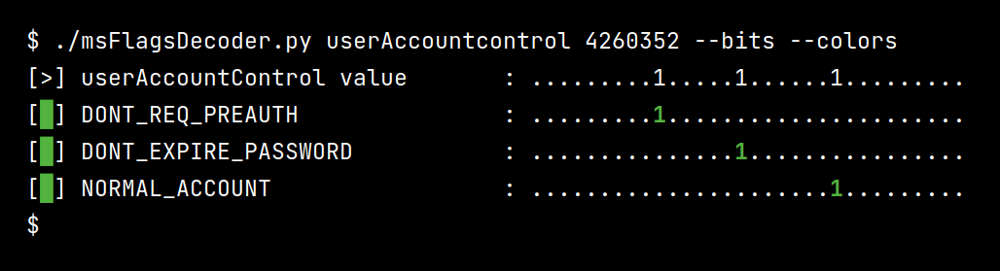

# msFlagsDecoder

<p align="center">
  Decode the values of common Windows properties such as userAccountControl and sAMAccountType.
  <br>
  
  <a href="https://twitter.com/intent/follow?screen_name=podalirius_" title="Follow"></a>
  <a href="https://www.youtube.com/c/Podalirius_?sub_confirmation=1" title="Subscribe"></a>
  <br>
</p>




## Usage

```
$ ./msFlagsDecoder.py -h
usage: msFlagsDecoder.py [-h] [-b] [-v] [--colors] attribute value

Decode the values of common Windows properties such as userAccountControl and sAMAccountType

positional arguments:
  attribute      attribute (choose from userAccountControl and sAMAccountType)
  value          value

options:
  -h, --help     show this help message and exit
  -b, --bits     show bits masks
  -v, --verbose  verbose mode
  --colors       print with colors
```

## Contributing

Pull requests are welcome. Feel free to open an issue if you want to add other features.
